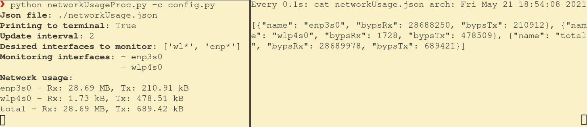

= Monitor Network Usage
:toc:
:sectnums:
:sectnumlevels: 4

Monitor current network usage on Linux system.

== Usage

Run `networkUsageProc.py` and network usage monitoring is started.

Data is stored in json file (defaults to `./logs/networkUsage.json` - relative
to `networkUsageProc.py` location)

[source,json]
----
[
  {"name": "enp3s0", "bypsRx": 0, "bypsTx": 0},
  {"name": "wlp4s0", "bypsRx": 51152, "bypsTx": 3183824},
  {"name": "total", "bypsRx": 51152, "bypsTx": 3183824}
]
----

Default monitored interfaces are all that match this parameters:

- `wl*`
- `enp*`
- `eth?:`

=== Script parameters

[source]
----
python networkUsageProc.py [OPTIONS]

Options:
  -h, --help        show this help

  -f, --file        json file location - OPTIONAL
                    If this parameter is not specified the file is located
                    at './logs/networkUsage.json' (relative to this script location).

  -p, --print       print network usage to the terminal also - OPTIONAL

  -u, --interval    update interval in seconds - OPTIONAL
                    Interval at which network usage is updated.
                    Defaults to 1 second.

  -i, --interfaces  interfaces to monitor - OPTIONAL
                    Full or partial (Regular Expression) interface name.
                    For multiple interfaces separate them with comma (without space).
                    Example: -i 'eth0:,wl*'
                             -i 'eth0:','wl*'

  -c, --config      custom configuration file - OPTIONAL
                    For example take a look at 'config_dflt.py' or
                    pass '-s' to script to print 'config_dflt.py' to terminal.

  -s, --show        print default configuration file to the terminal
----

== Dependencies
* Python (tested with `Python 3.9.5`)

== Development
Before each commit check source code with `make check` command.

WARNING: If there are some errors fix them before committing!

=== Dependencies
* https://www.gnu.org/software/make/[GNU - make]
* `pip` link:requirements.dev.txt[requirements.dev.txt]

== License
See the link:./LICENSE.adoc[LICENSE] file for license rights and limitations (MIT).

== TODO

- [ ] Don't throw error when `CTRL+C` is pressed

- [ ] Measure real sleep duration - more accurate network usage measurement

- [x] Document code

- [x] Add code checking

- [x] Add option to pass parameters to script (interfaces to monitor, json file location,
update rate)

- [x] Add option to display network usage only/also to terminal (not into `.json` file)

- [x] Add help message
